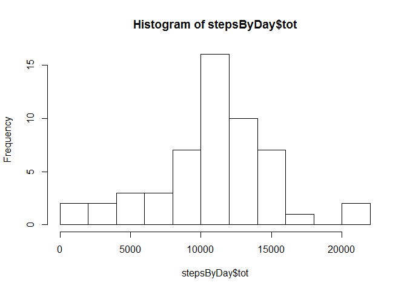

# Reproducible Research: Peer Assessment 1


## Loading and preprocessing the data

```r
require(dplyr)
require(zoo)
require(lattice)
unzip("activity.zip")
activity <- read.csv("activity.csv", stringsAsFactors = FALSE)
activity$date = as.Date(activity$date)
```

## What is mean total number of steps taken per day?

### Histogram

```r
stepsByDay <-
    activity %>%
    group_by(date) %>%
    summarise(tot = sum(steps))
hist(stepsByDay$tot,breaks=10)
```

 

### Mean value

```r
mean(stepsByDay$tot, na.rm = TRUE)
```

```
## [1] 10766.19
```

### Median value

```r
median(stepsByDay$tot, na.rm = TRUE)
```

```
## [1] 10765
```

## What is the average daily activity pattern?

### Plot of typical day

```r
stepsByInterval <-
    activity %>%
    group_by(interval) %>%
    summarise(avg = mean(steps, na.rm = TRUE))
plot(stepsByInterval, type = "l")
```

 

### Most intense interval
The following is the 5-minute interval containing the maximum number of steps:

```r
stepsByInterval$interval[which.max(stepsByInterval$avg)]
```

```
## [1] 835
```

## Imputing missing values

### Number of missing values

```r
sum(is.na(activity$steps))
```

```
## [1] 2304
```

### Filling missing values
To fill NA values my strategy is repetition of the leftmost or rightmost non-NA value in the exterior, and linear interpolation in the interior. I do this using the function na.fill from the zoo package:

```r
activityFilled <- activity
activityFilled$steps <- na.fill(activity$steps, "extend")
stepsByDayFilled <-
    activityFilled %>%
    group_by(date) %>%
    summarise(tot = sum(steps))
hist(stepsByDayFilled$tot,breaks=10)
```

 

### Mean value

```r
mean(stepsByDayFilled$tot)
```

```
## [1] 9354.23
```

### Median value

```r
median(stepsByDayFilled$tot)
```

```
## [1] 10395
```

The values are now lower, as my strategy gives more days with zero activity.

## Are there differences in activity patterns between weekdays and weekends?

```r
day <- as.factor(ifelse(weekdays(activityFilled$date) %in% c("Saturday","Sunday"), "Weekend", "Weekday"))
activityExtended <- cbind(activityFilled, day)
stepsByIntervalExtended <-
    activityExtended %>%
    group_by(interval, day) %>%
    summarise(avg = mean(steps, na.rm = TRUE))
xyplot(avg ~ interval|day,stepsByIntervalExtended, type = "l", layout = c(1,2))
```

 
